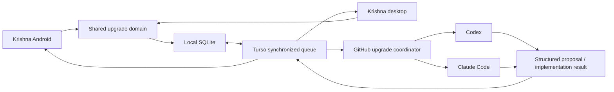

# Krishna Automation with LLM Coding Agents

## Purpose

Allow Krishna to capture self-improvement requests from voice or text, collect safe suggestions from coding agents, present the suggestions on Android and desktop, and create code only after explicit user approval.

Example request:

> Krishna, improve yourself so you can zoom maps and images by voice.

The product is not allowed to silently edit, merge, release, or install its own code.

## Product Decision

Krishna's Android and desktop applications are the **control plane**:

- capture requests;
- show proposals, risks, test plans, and code-review results;
- let the user request analysis, approve implementation, reject work, or open a draft pull request.

GitHub Actions is the initial **execution plane**. It gives Codex and Claude Code an isolated checkout, a reproducible development environment, and a normal CI path. The work continues even when the phone and desktop application are closed.

Turso synchronization is the shared **queue and result store**. Android and desktop continue to use their local SQLite database offline, then synchronize tasks and results when they have network access.



Cursor is intentionally out of scope for the first release. The provider model remains extensible so it can be added later without changing the task or approval model.

## Existing Repository Fit

The repository already provides the core foundations for this design:

- one React application and `KrishnaProvider` command flow for Android and desktop;
- local SQLite migrations through Tauri;
- Turso synchronization, including a cross-device command table;
- secure storage for credentials;
- a GitHub workflow dispatch integration;
- Android-specific and desktop-specific routes.

Important implementation detail: sync table definitions are currently maintained in more than one transport. Any new synchronized table must be added to the local migration, the shared sync table list, the LibSQL transport schema, and the Rust-backed Android transport schema.

## Cross-Platform UI

The upgrade business logic and visual components must be shared. Only the navigation shell differs.

### Desktop

- Keep **App Settings** in the sidebar.
- Add an **Upgrades** settings subsection with a queue/proposal badge.
- Add route: `/settings/upgrades`.
- Show a full, filterable table with expandable task details.

### Android

- Convert `/mobile/settings` into a settings menu.
- Include **Live Voice** and **Upgrades** rows.
- Add route: `/mobile/settings/upgrades`.
- Reuse the same shared components as desktop, rendered as expandable cards and bottom sheets for a narrow screen.

### Task List

| Task | Area | Status | Providers | Suggestion | Course of action | Updated | Actions |
| --- | --- | --- | --- | --- | --- | --- | --- |
| Voice map zoom | Android accessibility | Proposed | Codex + Claude | Use gesture executor | Implement draft branch | Today | Review |

Task details show five sections:

1. Request and acceptance criteria.
2. Evidence, including an explicitly approved failed-command reference.
3. Provider proposals and comparison.
4. Decision and run history.
5. Branch, pull request, tests, and release evidence.

## Voice and Text Capture

The shared command pipeline should recognize phrases before generic LLM handling:

- "improve yourself so that ...";
- "flag this for self improvement";
- "analyze the next upgrade now";
- "what upgrades are pending?";
- "approve the map zoom implementation".

Capture flow:

1. Extract and summarize the requested improvement.
2. If the user says "this task", identify the most recent relevant command result.
3. Ask whether that command evidence should be attached.
4. Ask for confirmation before creating the task.
5. Store the task locally and synchronize it.

Do not automatically send conversation history, screenshots, user content, or secrets to a coding provider.

## Data Model

One table is not sufficient because each task may have multiple providers, retries, approvals, and implementation attempts. Use three initial synchronized tables.

### `upgrade_tasks`

Stable user request and coordinator-owned status.

- `id`, `title`, `request_text`, `normalized_goal`;
- `acceptance_criteria_json`, `area`, `priority`, `source`;
- `origin_command_log_id`, `context_json`, `platform`, `app_version`;
- `status`, `provider_policy`, `latest_run_id`;
- `created_at`, `updated_at`.

### `upgrade_runs`

One row per provider execution.

- `id`, `task_id`, `stage`, `provider`, `status`;
- `suggestion_summary`, `recommended_action`, `alternatives_json`;
- `risks_json`, `affected_files_json`, `test_plan_json`;
- `provider_run_id`, `github_run_id`, `branch_name`, `pr_url`;
- cost/token fields, error details, timestamps.

### `upgrade_events`

Append-only user actions and audit history.

- `id`, `task_id`, optional `run_id`;
- `event_type`, `actor`, `note`, `created_at`, `updated_at`.

Example events: `task_created`, `manual_analysis_requested`, `proposal_approved`, `revision_requested`, `proposal_rejected`, `implementation_approved`, `implementation_rejected`, and `archived`.

Clients append events instead of competing to overwrite a task status. The GitHub coordinator consumes events and owns workflow state. This avoids Android and desktop synchronization conflicts.

Large terminal logs and patches remain GitHub artifacts. Krishna stores safe summaries, hashes, statuses, and links. A separate `upgrade_artifacts` table can be added later if needed.

## State Machine and Approval Gates

```text
Captured -> Queued -> Analyzing -> Proposed
                                  |
                         Approved for code
                                  |
                             Implementing
                                  |
                           Review ready
                                  |
                    Completed / Rejected / Failed
```

There are two mandatory approvals:

1. **Approve implementation** permits an isolated agent to modify a branch and create a draft pull request.
2. **Approve merge or release** is a separate later decision.

Agents must never write directly to `main`, merge a pull request, publish a release, or install an update without a separate user action.

## Provider Policy

Initial provider policy:

- Codex creates the first proposal and, after approval, can implement it.
- Claude Code provides an independent review of the proposal or resulting diff.
- The user may select Codex-only, Claude-only, or Codex-plus-Claude.
- Exactly one provider implements an approved proposal; the other provider reviews it.

Proposal runs are read-only. They return a normalized structured response containing:

- understanding of the problem;
- root-cause hypothesis;
- recommended approach and alternatives;
- affected files;
- risks and privacy/security concerns;
- test plan;
- expected user impact and effort;
- blockers or questions.

Provider credentials belong only in GitHub Secrets. They must never be bundled into the Android APK or stored in the desktop application.

Each provider receives durable repository guidance:

- root `AGENTS.md` with architecture, commands, constraints, and validation expectations;
- `CLAUDE.md` pointing to that guidance;
- a versioned proposal JSON schema;
- per-task scope and acceptance criteria;
- explicit prohibition on unrelated refactors, direct main writes, merge, release, and secret access.

## Scheduling and Manual Trigger

The GitHub coordinator runs every six hours, but it selects at most one automatic task per rolling 24-hour window. This is more resilient than a single exact daily cron.

Rules:

- choose the highest-priority oldest queued task;
- use a concurrency lock to prevent duplicate work;
- do not call a provider when no task is queued;
- set timeout, token, and cost limits per run;
- record errors and allow retries.

Manual execution has two paths:

1. append a `manual_analysis_requested` event, which the next scheduled coordinator will honor;
2. attempt an immediate GitHub workflow dispatch from Android or desktop.

If immediate dispatch fails because the device is offline, the synchronized event stays queued. A separate repository-scoped GitHub token is needed for manual dispatch; it must not reuse the current Job Hunter-specific integration configuration.

## Security Boundaries

- Provider keys exist only in GitHub Secrets.
- Android and desktop store only a narrow GitHub token for manual workflow dispatch, in platform secure storage.
- Proposal jobs use read-only repository access.
- Implementation jobs use an isolated branch and least-privilege workspace write access.
- Coordinator credentials are kept separate from provider jobs whenever possible.
- Main branch protection and CI remain mandatory.
- Prompt input from command logs/screens/screenshots is treated as untrusted data.
- The default is no automatic code generation, no automatic merge, and no automatic release.

## Delivery Plan

### Stage 0 - Architecture Contract

- Add this plan, the state-transition contract, the proposal schema, and agent guidance.
- Define cost limits, provider configuration, and GitHub secret names.
- No runtime functionality.

### Stage 1 - Shared Local Foundation

- Add local SQLite tables, core types, validation, and database actions.
- Add the shared upgrade feature UI.
- Add the desktop and Android settings routes.
- Add voice/text task capture and confirmation.
- Support local task creation, filters, edits, and archive.
- No provider or GitHub calls.

Exit criterion: the same feature works in Android and desktop builds using only local data.

### Stage 2 - Cross-Device Queue

- Register the upgrade tables in every sync schema and transport.
- Synchronize tasks, runs, and append-only events.
- Add offline/sync status indicators.
- Test Android-created tasks appearing on desktop and vice versa.

Exit criterion: task state and approval events converge reliably across devices.

### Stage 3 - Manual Codex Proposal

- Add a dedicated GitHub upgrade integration and secure repository-scoped token.
- Add a GitHub Actions coordinator.
- Add Codex read-only proposal execution and normalized results.
- Add **Analyze now** on Android and desktop.
- Show proposal, risks, affected files, alternatives, and test plan.
- Do not allow implementation yet.

Exit criterion: either platform can request a safe proposal and both receive the same result.

### Stage 4 - Claude Review and Automatic Analysis

- Add Claude Code as the reviewer provider.
- Add Codex-only, Claude-only, and Codex-plus-Claude modes.
- Add rolling 24-hour automation, retries, limits, and new-proposal badges.
- Add manual provider comparison.

Exit criterion: one queued task can be analyzed automatically and reviewed from either device.

### Stage 5 - Approved Implementation and Draft PR

- Add the implementation approval event.
- Create an isolated task branch.
- Allow agent edits only in that branch.
- Run focused tests, typecheck, and broader validation.
- Run a second-provider review.
- Create a draft pull request and synchronize test evidence back to Krishna.
- Never merge automatically.

Exit criterion: an approved proposal produces a tested draft PR with clear review evidence.

### Stage 6 - Release Feedback Loop

- Track whether a proposal or pull request was accepted, rejected, or revised.
- Link releases to completed upgrade tasks.
- Add explicit release approval and signed Android/desktop build evidence.
- Consider optional local desktop-runner and Cursor support only after the shared cloud workflow is stable.

## Validation Strategy

Every stage requires:

- focused unit tests for types, state transitions, parsing, and database actions;
- synchronization tests for task/event convergence;
- desktop route and responsive UI tests;
- Android route and responsive UI tests;
- typecheck and relevant existing test suite;
- manual verification on both Android and desktop before the next stage is approved.

## Required Approvals

1. Approve each delivery stage before implementation begins.
2. Approve every individual task before code generation.
3. Approve every merge/release separately.

Recommended defaults:

1. Turso is the shared queue and GitHub Actions is the initial runner.
2. Codex is primary and Claude Code is the reviewer.
3. One automatic proposal per rolling 24 hours.
4. An approval button creates a tested draft pull request; it never merges code.
