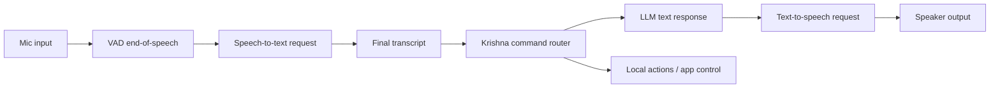
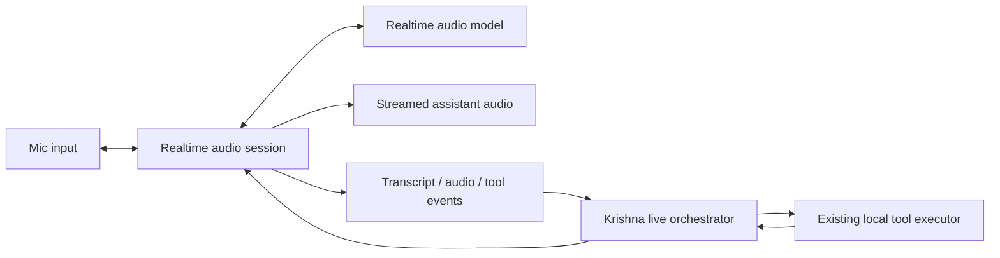
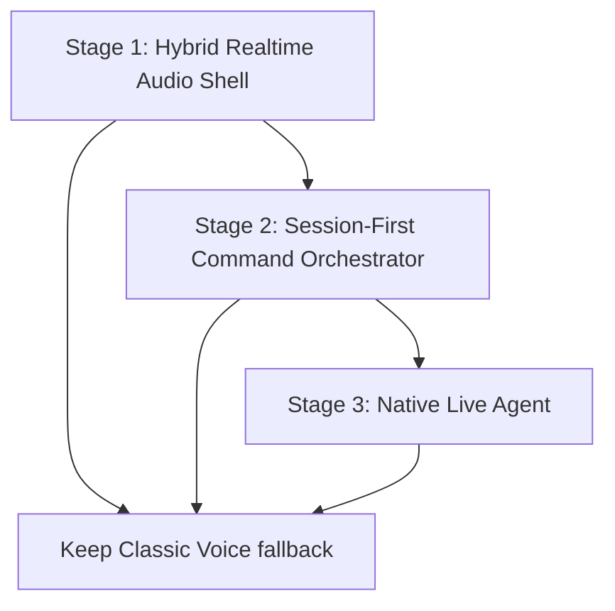

# Krishna Realtime Audio Agent Plan

Last updated: 2026-07-09

This document is a handoff for a coding agent. It describes how to migrate Krishna from a stitched voice pipeline:

```text
VAD -> STT -> LLM -> TTS
```

to a Realtime audio session where speech, interruption, transcript events, and tool calls happen inside one low-latency session.

Do not implement all stages in one pass. Implement one stage, test it locally, stop for review, then continue to the next stage only after approval.

## Official References

- Realtime guide: https://developers.openai.com/api/docs/guides/realtime
- Realtime conversations: https://developers.openai.com/api/docs/guides/realtime-conversations
- Realtime API reference: https://developers.openai.com/api/reference/resources/realtime
- OpenAI pricing: https://openai.com/api/pricing/

Verify pricing and model names before implementation. The cost section below is a planning estimate as of 2026-07-09.

## Current Problem

The current assistant feels slow because each voice turn is serialized:

1. User speaks.
2. VAD waits for end of speech.
3. Audio is sent to STT.
4. Text is sent to the LLM.
5. Text response is sent to TTS.
6. Audio finally plays.

Even if each step is individually fast, the total latency stacks up. Voice ID can also block the command path when it is awaited before processing.

## Current Pipeline



## Target Pipeline



The target is not just faster STT or faster TTS. The target is a different shape: one persistent audio session instead of multiple sequential requests.

## Recommended End State

Krishna should support two voice modes:

- `Classic Voice`: existing VAD -> STT -> LLM -> TTS path, kept as a stable fallback.
- `Live Voice`: Realtime audio session with streaming audio, interruption, transcript events, and tool-call orchestration.

The existing fast local command lane should stay. Obvious commands such as "open Chrome", "move Chrome to monitor 2", and saved searches should not always require a full live model response.

## Stage Overview



## Stage 1: Hybrid Realtime Audio Shell

Goal: introduce a Realtime audio session behind a feature flag without replacing the existing production voice path.

### Coding Instructions

1. Add a feature flag or setting named something like `liveVoiceEnabled`.
2. Create a Realtime client module, for example:
   - `src/lib/realtime/realtime-client.ts`
   - `src/lib/realtime/realtime-events.ts`
   - `src/lib/realtime/realtime-types.ts`
3. Use WebRTC for the browser/Tauri renderer path if practical. Use WebSocket only if WebRTC is blocked or too complex for the first local test.
4. Do not expose a long-lived OpenAI API key in the renderer. Prefer an ephemeral session/token flow.
5. Add a small live voice sandbox UI first, before wiring it into the main assistant path.
6. Stream microphone audio into the Realtime session.
7. Play streamed assistant audio directly from Realtime output audio events.
8. Display transcript deltas in the existing or new latency/dev panel.
9. Keep the existing `KrishnaVAD` and `processCommand` flow unchanged for classic mode.
10. Add a clean disconnect path for mic, peer connection/socket, audio tracks, and event listeners.

### Acceptance Criteria

- Classic voice still works exactly as before.
- Live voice can start and stop from a local UI flag or dev control.
- Live voice can complete a simple conversational roundtrip.
- Transcript deltas and assistant audio are visible/audible during the turn, not only at the end.
- No API key is committed or stored in frontend source.
- The app handles disconnect and reconnect without a full restart.

### Suggested Tests

- Unit-test the Realtime event reducer/parser with mocked events.
- Unit-test session state transitions: `idle`, `connecting`, `connected`, `speaking`, `disconnecting`, `error`.
- Manually test start, speak, interrupt, stop, reconnect.

### Main Tradeoff

Stage 1 gives a safe proving ground. It may not fully reduce command latency yet because the old command router still exists, but it validates the hardest audio plumbing before touching the core assistant.

## Stage 2: Session-First Command Orchestrator

Goal: let the Realtime session drive live turns while Krishna remains the authority for local tools, confirmations, and safety.

### Coding Instructions

1. Add a live orchestrator module, for example:
   - `src/lib/realtime/live-orchestrator.ts`
   - `src/lib/realtime/live-tool-bridge.ts`
2. Register Krishna actions as Realtime tools with strict JSON schemas.
3. Route Realtime tool calls through the existing local executor, not through new duplicated action code.
4. Keep sensitive actions behind confirmation:
   - file operations
   - browser actions with side effects
   - app control with destructive behavior
   - external network or account changes
5. When the model proposes a sensitive tool call, pause execution and ask the user for spoken or UI confirmation.
6. Add interruption support:
   - detect user speech while assistant audio is playing
   - cancel current response
   - stop current audio playback
   - start listening immediately
7. Integrate Voice ID as a safety signal, not as a hard latency blocker.
8. Preserve the fast local command lane. If an utterance is obviously local and safe, execute locally with minimal model involvement.
9. Record timing marks for:
   - mic start
   - speech start
   - speech end
   - first transcript delta
   - final transcript
   - first assistant audio
   - tool call received
   - tool executed
   - response complete
10. Add explicit offline behavior:
   - detect Realtime connection failure and internet loss
   - do not freeze the assistant when Live Voice cannot connect
   - show a clear status such as `Live Voice unavailable: offline`
   - keep Classic Voice available if its dependencies work
   - keep text command input available as the guaranteed offline control path
   - allow local deterministic text commands to run offline
   - do not require Realtime for app/window/monitor movement commands
   - make voice commands offline only if a local/offline STT path exists
   - keep YouTube/music actions marked online-required unless local playback exists
   - add a `network_error` or `offline` session state in the Realtime client

### Acceptance Criteria

- Live voice can execute at least one existing safe local action.
- Sensitive actions ask for confirmation before execution.
- Barge-in cancels assistant speech reliably.
- Existing fast commands remain faster than generic live model commands.
- Voice ID timeout does not block the main command path.
- Latency panel shows Realtime-specific timing marks.
- If internet is unavailable, Live Voice fails gracefully and local text commands still work.
- App/window/monitor movement does not depend on Realtime when a deterministic command is available.
- YouTube/music requests clearly fail or defer when offline instead of pretending they succeeded.

### Suggested Tests

- Unit-test tool-call validation.
- Unit-test confirmation gating.
- Unit-test cancellation state transitions.
- Unit-test fast-command bypass behavior.
- Unit-test offline/network failure fallback behavior.
- Add mocked Realtime events for transcript, response audio, tool call, tool result, and cancellation.

### Main Tradeoff

Stage 2 is where the product starts to feel "live". It is also where safety complexity increases because the model can request tools during a live conversation. The local orchestrator must remain in control.

### Offline Behavior Notes

With the current architecture, Krishna can only work offline for actions that are fully local and already have an input path. For example, app/window/monitor movement can work offline if the command is provided as text or recognized by a local/offline speech path. Cloud STT, cloud LLM reasoning, cloud TTS, and YouTube playback/search will fail without internet.

After Realtime is added, Live Voice becomes more internet-dependent because the audio session itself needs network access. Therefore Stage 2 must treat Realtime as an online live mode, not as the only brain. Local deterministic commands should remain independent, and Classic Voice/text control should remain available as fallback paths.

## Stage 3: Native Live Agent

Goal: make Live Voice the primary low-latency experience while keeping Classic Voice as fallback.

### Coding Instructions

1. Move session instructions, voice behavior, and tool schemas into a coherent live session configuration.
2. Add explicit cost controls:
   - max session duration
   - max assistant speech length
   - context truncation policy
   - optional push-to-talk mode
   - optional local-command-only mode
3. Add session refresh/compaction so long conversations do not accumulate unbounded context.
4. Add robust fallback:
   - if Realtime connection fails, offer Classic Voice
   - if tool-call validation fails, ask the user to retry
   - if audio output fails, show transcript text
5. Add observability:
   - per-turn event timeline
   - estimated audio input/output tokens
   - estimated cost per session
   - error reason and reconnect count
6. Make the live agent interruption-first:
   - user speech should always be able to interrupt assistant speech
   - cancellation should cleanly stop audio and model response
7. Keep local deterministic commands available outside the live model path.

### Acceptance Criteria

- Live Voice is usable as the default voice mode.
- Classic Voice remains available as fallback.
- Long sessions do not grow cost/context without bounds.
- The UI shows a useful session-level cost estimate.
- The app can recover from network drops.
- Tool execution is auditable from logs/dev panel.

### Suggested Tests

- Unit-test context truncation and session refresh policies.
- Unit-test cost estimator.
- Unit-test fallback selection.
- Integration-test a mocked long session with transcript, tool calls, interruption, reconnect, and completion.

### Main Tradeoff

Stage 3 delivers the best user experience but creates the most vendor coupling and runtime cost exposure. It should only happen after Stages 1 and 2 prove reliability locally.

## Cost Model

Realtime audio is usually billed by tokens, including audio tokens. A useful planning approximation:

- User audio input: about 1 token per 100 ms of user speech.
- Assistant audio output: about 1 token per 50 ms of assistant speech.

That means:

- 1 minute of user speech is about 600 input audio tokens.
- 1 minute of assistant speech is about 1,200 output audio tokens.

Estimated costs below are examples only. Verify current pricing before coding or rollout.

### Example: Full Realtime Model

Assume:

- Audio input: `$32 / 1M tokens`
- Audio output: `$64 / 1M tokens`

Estimated speech-only cost:

- User speaking: `600 * 32 / 1,000,000 = $0.0192` per minute of user speech.
- Assistant speaking: `1,200 * 64 / 1,000,000 = $0.0768` per minute of assistant speech.
- 10 minute session with 5 minutes user speech and 5 minutes assistant speech: about `$0.48`, plus text/tool/context overhead.
- 1 hour session with 30 minutes user speech and 30 minutes assistant speech: about `$2.88`, plus text/tool/context overhead.

### Example: Mini Realtime Model

Assume:

- Audio input: `$10 / 1M tokens`
- Audio output: `$20 / 1M tokens`

Estimated speech-only cost:

- User speaking: `600 * 10 / 1,000,000 = $0.006` per minute of user speech.
- Assistant speaking: `1,200 * 20 / 1,000,000 = $0.024` per minute of assistant speech.
- 10 minute session with 5 minutes user speech and 5 minutes assistant speech: about `$0.15`, plus text/tool/context overhead.
- 1 hour session with 30 minutes user speech and 30 minutes assistant speech: about `$0.90`, plus text/tool/context overhead.

## Cost Tradeoffs

### What Gets Cheaper

- Fewer separate STT, LLM, and TTS roundtrips to orchestrate.
- Less engineering complexity in stitching partial audio systems once Live Voice is mature.
- Less perceived latency, which is the main product value.

### What Gets More Expensive

- Assistant audio output can be expensive if Krishna talks too much.
- Long-running sessions can accumulate context and increase text token cost.
- Always-on listening can create unnecessary input audio tokens if not gated.
- Live tool orchestration needs more testing, logging, and safety work.

### Cost Controls To Implement

- Keep short assistant responses by default.
- Use local fast lane for deterministic commands.
- Add push-to-talk or wake-word gating.
- Stop or suspend Realtime sessions after inactivity.
- Truncate or summarize session context.
- Show estimated session cost in the dev panel.
- Use a mini realtime model when quality is acceptable.
- Keep Classic Voice for low-cost fallback scenarios.

## Architecture Decision

Recommended path:

1. Implement Stage 1 first.
2. Test locally with a feature flag.
3. Review security, API-key handling, audio quality, and latency.
4. Implement Stage 2 only after Stage 1 is stable.
5. Implement Stage 3 only after tool safety and cost controls are proven.

Do not remove the existing voice pipeline during this migration. The right architecture is additive first, then selective replacement.

## Agent Guardrails

The coding agent must follow these rules:

1. Read this file before coding.
2. Read the current repo state and any resume/handoff files before coding.
3. Do not touch unrelated files.
4. Do not remove Classic Voice.
5. Do not commit secrets.
6. Do not duplicate local action execution logic.
7. Put Realtime code behind a feature flag.
8. Add tests for reducers, event parsing, tool validation, confirmation, cancellation, and cost estimation.
9. Run typecheck and targeted tests before handoff.
10. Stop after each stage for human review.

## Review Checklist

Use this checklist after each stage:

- Does Classic Voice still work?
- Does Live Voice fail closed when credentials or network are missing?
- Are API keys protected?
- Are local tools executed only through the approved executor?
- Are sensitive actions confirmed?
- Can the user interrupt assistant speech?
- Is latency measured?
- Is cost estimated?
- Are tests meaningful and passing?
- Is the implementation small enough to review safely?
